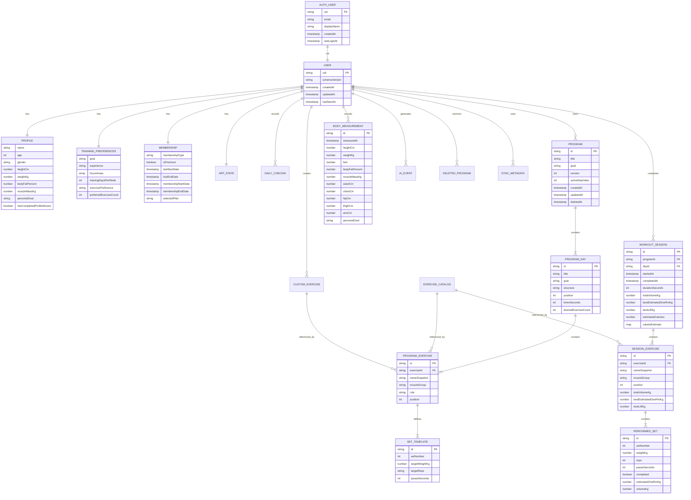

# Firebase / Firestore Database ERD

Status: Designgrundlag, ingen Firebase-implementering  
Senest opdateret: 12. juni 2026

## 1. Formål

Dette dokument beskriver den fremtidige Firebase Authentication- og Cloud
Firestore-struktur for AI Training Canvas. Modellen tager udgangspunkt i
appens nuværende funktioner og localStorage-data.

Målet er:

- én tydelig ejer af alle brugerdata
- synkronisering mellem brugerens enheder
- offline/localStorage fallback
- sikker adskillelse mellem brugerdata og serverstyret medlemskab
- historik, der kan bruges til 1RM, volumen, dashboard og Min udvikling
- mulighed for gradvis migrering uden at slette nuværende lokale data

Firebase skal ikke implementeres som en del af dette dokument.

## 2. Dataklassifikation

| Lifecycle | Betydning | Eksempler |
|---|---|---|
| `persistent` | Gemmes, indtil brugeren eller en gyldig retention-regel sletter data | profil, programmer, træningshistorik, kropsmål |
| `temporary` | Arbejdsdata, cache eller kladde, som kan overskrives eller udløbe | aktiv træningskladde, UI-state, sidste synkronisering |
| `single_use` | Bruges én gang og gemmes ikke som selvstændig historik | wizard-formularstate, popup-state, password reset-token |

## 3. Overordnet Firestore-struktur

```text
users/{uid}
  profile/main
  preferences/training
  membership/current
  appState/current

  dailyCheckins/{yyyy-MM-dd}
  programs/{programId}
    days/{dayId}
      exercises/{programExerciseId}
        sets/{setTemplateId}

  workoutSessions/{sessionId}
    exercises/{sessionExerciseId}
      sets/{performedSetId}

  bodyMeasurements/{measurementId}
  customExercises/{exerciseId}
  aiCopilotHistory/{eventId}
  deletedPrograms/{programId}
  syncMetadata/{deviceId}

exerciseCatalog/{exerciseId}
membershipPlans/{planId}
```

Firebase Authentication ejer loginidentiteten. Firestore-dokumentet
`users/{uid}` bruger samme `uid` som Firebase Auth.

## 4. ERD



## 5. Datatyper og Firestore paths

### 5.1 Firebase Authentication-bruger

**Navn:** Auth user  
**Formål:** Login, sessionsikkerhed og identitet.  
**System:** Firebase Authentication, ikke en almindelig Firestore collection.  
**Lifecycle:** `persistent`  
**Owner:** Den autentificerede bruger; credentials administreres af Firebase Auth.  
**Retrievable:** Ja, via `auth.currentUser`.  
**Deletable:** Ja, via kontosletning med nylig autentificering.  
**Device sync:** Ja.

Felter leveret af Firebase Auth:

| Felt | Type | Note |
|---|---|---|
| `uid` | string | Primær identifikator |
| `email` | string/null | Må ikke kopieres unødigt til klientstyrede dokumenter |
| `displayName` | string/null | Valgfrit |
| `photoURL` | string/null | Valgfrit |
| `emailVerified` | boolean | Styres af Auth |
| `providerData` | array | Google, password osv. |
| `metadata.creationTime` | timestamp-like | Auth-metadata |
| `metadata.lastSignInTime` | timestamp-like | Auth-metadata |

Adgangskoder, OAuth-tokens og password reset-tokens må aldrig gemmes i
Firestore eller localStorage.

### 5.2 Brugerrod

**Navn:** User  
**Formål:** Stabil brugerrod og teknisk metadata.  
**Firestore path:** `users/{uid}`  
**Lifecycle:** `persistent`  
**Owner:** Autentificeret bruger med samme `uid`.  
**Retrievable:** Ja.  
**Deletable:** Ja, som del af fuld kontosletning.  
**Device sync:** Ja.

Felter:

| Felt | Type | Krav |
|---|---|---|
| `uid` | string | Skal være lig document ID og `request.auth.uid` |
| `schemaVersion` | integer | Start eksempelvis med `1` |
| `createdAt` | timestamp | Server timestamp, write-once |
| `updatedAt` | timestamp | Server timestamp |
| `lastSeenAt` | timestamp | Kan opdateres periodisk, ikke ved hvert render |
| `dataRegion` | string/null | Fremtidig driftsmetadata |
| `accountDeletionRequestedAt` | timestamp/null | Kun ved sletteflow |

### 5.3 Træningsprofil

**Navn:** Profile  
**Formål:** Personlige oplysninger fra profilside og onboarding.  
**Firestore path:** `users/{uid}/profile/main`  
**Nuværende localStorage:** `training_profile_v1`  
**Lifecycle:** `persistent`  
**Owner:** Autentificeret bruger.  
**Retrievable:** Ja.  
**Deletable:** Ja; felter kan også nulstilles individuelt.  
**Device sync:** Ja.

Felter:

| Felt | Type | Validering |
|---|---|---|
| `name` | string | 0-100 tegn |
| `age` | integer/null | 13-120 |
| `gender` | string/null | `man`, `woman`, `not_specified` |
| `heightCm` | number/null | 50-250 |
| `weightKg` | number/null | 1-500 |
| `bodyFatPercent` | number/null | 0-100 |
| `muscleMassKg` | number/null | 0-300 |
| `personalGoal` | string | Maks. anbefalet længde 500 |
| `hasCompletedProfileWizard` | boolean | Profilwizard er afsluttet |
| `profileCompletedAt` | timestamp/null | Sættes første gang |
| `updatedAt` | timestamp | Server timestamp |

`BMI` bør ikke være et autoritativt profilfelt. Det beregnes fra højde og
vægt. Historiske BMI-værdier kan gemmes som snapshot på kropsmålinger.

### 5.4 Træningspræferencer

**Navn:** Training preferences  
**Formål:** Grundlag for programgenerator, daglig wizard og AI Copilot.  
**Firestore path:** `users/{uid}/preferences/training`  
**Nuværende localStorage:** Del af `training_profile_v1`  
**Lifecycle:** `persistent`  
**Owner:** Autentificeret bruger.  
**Retrievable:** Ja.  
**Deletable:** Ja; kan nulstilles til defaults.  
**Device sync:** Ja.

Felter:

| Felt | Type | Tilladte værdier |
|---|---|---|
| `goal` | string | `muscle_gain`, `weight_loss`, `strength`, `general_health` |
| `experience` | string | `beginner`, `light_intermediate`, `intermediate`, `experienced` |
| `focusAreas` | array<string> | Bryst, Skuldre, Arme, Ben, Core, Ryg |
| `trainingDaysPerWeek` | integer | 1-7 |
| `exercisePreference` | string | `variation`, `consistent`, `mixed` |
| `preferredExerciseCount` | integer | 1-8 |
| `updatedAt` | timestamp | Server timestamp |

### 5.5 Wizard-formularstate

**Navn:** Wizard draft  
**Formål:** Midlertidige svar, før brugeren afslutter en wizard.  
**Firestore path:** Ingen som standard.  
**Local path:** `sessionStorage` eller in-memory state.  
**Lifecycle:** `single_use`  
**Owner:** Den lokale app-session.  
**Retrievable:** Kun under den aktive wizard.  
**Deletable:** Ja, straks ved afslutning/annullering.  
**Device sync:** Nej.

Felter kan omfatte:

- `step: integer`
- `mode: string`
- `goal: string`
- `heightCm: number`
- `weightKg: number`
- `age: integer`
- `gender: string`
- `experience: string`
- `trainingDaysPerWeek: integer`
- `focusAreas: array<string>`
- `exercisePreference: string`
- `generatedPrograms: array<object>`

Kun det endelige profilvalg og oprettede programmer synkroniseres.

### 5.6 Daglig motivation

**Navn:** Daily check-in  
**Formål:** Gemme dagens motivation og valgte start-handling én gang pr. lokal dato.  
**Firestore path:** `users/{uid}/dailyCheckins/{yyyy-MM-dd}`  
**Nuværende localStorage:** `daily_start_v1`  
**Lifecycle:** `persistent` med anbefalet retention på 12-24 måneder  
**Owner:** Autentificeret bruger.  
**Retrievable:** Ja.  
**Deletable:** Ja.  
**Device sync:** Ja.

Felter:

| Felt | Type | Note |
|---|---|---|
| `localDate` | string | `YYYY-MM-DD` i brugerens lokale tidszone |
| `timezone` | string | Fx `Europe/Copenhagen` |
| `motivation` | string | `low`, `normal`, `high` |
| `selectedAction` | string/null | `continue`, `adapt`, `generate` |
| `createdAt` | timestamp | Server timestamp |
| `updatedAt` | timestamp | Server timestamp |

Pep-talk-teksten og det tilfældige indeks er præsentationsdata og bør ikke
gemmes.

### 5.7 App-state

**Navn:** App state  
**Formål:** Huske sidste aktive program og dag på tværs af enheder.  
**Firestore path:** `users/{uid}/appState/current`  
**Nuværende localStorage:** `last_active_program_id` samt dele af autosave  
**Lifecycle:** `temporary`  
**Owner:** Autentificeret bruger.  
**Retrievable:** Ja, men appen skal tåle manglende dokument.  
**Deletable:** Ja.  
**Device sync:** Ja.

Felter:

| Felt | Type |
|---|---|
| `lastActiveProgramId` | string/null |
| `lastActiveDayId` | string/null |
| `lastActiveDayIndex` | integer |
| `lastOpenedView` | string/null |
| `updatedAt` | timestamp |
| `updatedByDeviceId` | string/null |

UI-tilstand som åben menu, aktiv popup, scrollposition og timerknappens
hover-state skal kun leve lokalt.

### 5.8 Træningsprogram

**Navn:** Program  
**Formål:** Et gemt træningspas eller en ugeplan med en eller flere dage.  
**Firestore path:** `users/{uid}/programs/{programId}`  
**Nuværende localStorage:** `saved_workout_programs`  
**Lifecycle:** `persistent`  
**Owner:** Autentificeret bruger.  
**Retrievable:** Ja.  
**Deletable:** Soft delete først, permanent delete senere.  
**Device sync:** Ja.

Felter:

| Felt | Type | Note |
|---|---|---|
| `id` | string | Samme som document ID |
| `version` | integer | Nuværende model svarer til version 2 |
| `title` | string | Programnavn |
| `goal` | string | Mål ved oprettelse |
| `activeDayIndex` | integer | Sidst viste dag |
| `dayCount` | integer | Denormaliseret til lister |
| `exerciseCount` | integer | Denormaliseret samlet antal |
| `status` | string | `active`, `archived`, `deleted` |
| `createdAt` | timestamp | Server timestamp |
| `updatedAt` | timestamp | Server timestamp |
| `deletedAt` | timestamp/null | Soft delete |
| `purgeAfter` | timestamp/null | `deletedAt + 30 dage` |

### 5.9 Programdag

**Navn:** Program day  
**Formål:** Separat dagsvisning i et flerdagsprogram.  
**Firestore path:** `users/{uid}/programs/{programId}/days/{dayId}`  
**Lifecycle:** `persistent`  
**Owner:** Programmens ejer.  
**Retrievable:** Ja.  
**Deletable:** Ja.  
**Device sync:** Ja.

Felter:

| Felt | Type |
|---|---|
| `id` | string |
| `title` | string |
| `goal` | string |
| `structure` | string |
| `position` | integer |
| `desiredExerciseCount` | integer/null |
| `exerciseCount` | integer |
| `createdAt` | timestamp |
| `updatedAt` | timestamp |

`position` er den stabile sorteringsværdi. Document IDs må ikke bruges til
sortering. En programdag er en genbrugelig skabelon og må derfor aldrig få
status `completed`. Tid, gennemførte sæt og afslutningstid hører til en
træningssession.

### 5.10 Programøvelse

**Navn:** Program exercise  
**Formål:** En øvelse placeret på en bestemt programdag.  
**Firestore path:**  
`users/{uid}/programs/{programId}/days/{dayId}/exercises/{programExerciseId}`  
**Lifecycle:** `persistent`  
**Owner:** Programmens ejer.  
**Retrievable:** Ja.  
**Deletable:** Ja.  
**Device sync:** Ja.

Felter:

| Felt | Type | Note |
|---|---|---|
| `id` | string | Instans-ID, ikke katalog-ID |
| `exerciseId` | string/null | Reference til global eller brugerdefineret øvelse |
| `exerciseSource` | string | `catalog`, `custom`, `legacy` |
| `nameSnapshot` | string | Sikrer historisk læsbarhed ved navneændring |
| `muscleGroup` | string | Fx Bryst eller Øvre ryg |
| `movementType` | string | `Push`, `Pull`, `Stabilitet` |
| `role` | string | Fx `compound`, `accessory` |
| `goal` | string | Målprofil ved oprettelse |
| `position` | integer | Rækkefølge på dagen |
| `createdAt` | timestamp | |
| `updatedAt` | timestamp | |

### 5.11 Sæt-skabelon

**Navn:** Set template  
**Formål:** Planlagte sæt, reps, kg og pauser i programmet.  
**Firestore path:**  
`users/{uid}/programs/{programId}/days/{dayId}/exercises/{programExerciseId}/sets/{setTemplateId}`  
**Lifecycle:** `persistent`  
**Owner:** Programmens ejer.  
**Retrievable:** Ja.  
**Deletable:** Ja.  
**Device sync:** Ja.

Felter:

| Felt | Type | Note |
|---|---|---|
| `setNumber` | integer | 1-20 |
| `targetWeightKg` | number/null | Planlagt vægt |
| `targetReps` | string/null | Kan være `8`, `8-12` osv. |
| `pauseSeconds` | integer | Gem sekunder, ikke teksten `1m30s` |
| `pauseManual` | boolean | Må auto-pause overskrive feltet? |
| `previousPerformanceText` | string/null | Kun cache/præsentation |
| `updatedAt` | timestamp | |

`completed` hører ikke til en programskabelon. Det hører til en aktiv eller
afsluttet træningssession.

### 5.12 Aktiv træningskladde

**Navn:** Active workout draft  
**Formål:** Gendanne en påbegyndt træning efter reload eller enhedsskift.  
**Firestore path:** `users/{uid}/activeWorkout/current` (valgfri cloud backup)  
**Nuværende localStorage:** `active_workout_autosave`  
**Lifecycle:** `temporary`  
**Owner:** Autentificeret bruger.  
**Retrievable:** Ja, mens kladden er aktiv.  
**Deletable:** Ja; slettes efter afslutning eller aktiv kassering.  
**Device sync:** Valgfrit. Lokal autosave er primær for hurtighed.

Felter:

| Felt | Type |
|---|---|
| `schemaVersion` | integer |
| `programId` | string/null |
| `dayId` | string/null |
| `dayIndex` | integer |
| `title` | string |
| `goal` | string |
| `timerSeconds` | integer |
| `sessionId` | string |
| `sessionStatus` | string | `not_started`, `in_progress`, `completed` |
| `startedAt` | timestamp/null |
| `completedAt` | timestamp/null |
| `desiredExerciseCount` | integer/null |
| `exercises` | array/map eller draft-subcollection |
| `updatedAt` | timestamp |
| `updatedByDeviceId` | string |
| `expiresAt` | timestamp |

Anbefaling: behold hurtige tasteændringer lokalt og upload en debounced
snapshot hvert 5.-15. sekund eller ved væsentlige handlinger. Kladden bør
udløbe efter eksempelvis 7 dage.

### 5.13 Afsluttet træningssession

**Navn:** Workout session  
**Formål:** Autoritativ historik for Dashboard og Min udvikling.  
**Firestore path:** `users/{uid}/workoutSessions/{sessionId}`  
**Nuværende localStorage:** `training_analytics_history`  
**Lifecycle:** `persistent`  
**Owner:** Autentificeret bruger.  
**Retrievable:** Ja.  
**Deletable:** Ja, med tydelig bekræftelse.  
**Device sync:** Ja.

Felter:

| Felt | Type | Note |
|---|---|---|
| `id` | string | Samme som document ID |
| `sessionStatus` | string | Altid `completed` i historik |
| `programId` | string/null | Program kan senere være slettet |
| `programTitleSnapshot` | string | Historisk navn |
| `dayId` | string/null | |
| `dayIndex` | integer | |
| `dayTitleSnapshot` | string | |
| `startedAt` | timestamp/null | |
| `completedAt` | timestamp | |
| `durationSeconds` | integer | Ikke formateret tekst |
| `totalVolumeKg` | number | Snapshot/summary |
| `bestEstimatedOneRmKg` | number | Snapshot/summary |
| `bestLiftKg` | number | Snapshot/summary |
| `estimatedCalories` | integer | Samlet estimeret kalorieforbrug |
| `calorieEstimate` | map | Firestore-klar beregningssnapshot med input, faktorer og præcision |
| `exerciseCount` | integer | |
| `completedSetCount` | integer | |
| `source` | string | `manual`, `program`, `wizard`, `ai_adapted` |
| `schemaVersion` | integer | |

Sessionens summaryfelter kan gemmes for hurtige lister, men skal kunne
genberegnes fra de udførte sæt.

`calorieEstimate` gemmer `schemaVersion`, kvalitetsniveau, profilinput,
træningstid, intensitet, sæt, reps, volumen, øvelsesfordeling og de anvendte
korrektionsfaktorer. Det gør historikken reproducerbar, selv hvis
beregningsmodellen senere ændres.

### 5.14 Sessionøvelse

**Navn:** Session exercise  
**Formål:** Historisk øvelsesresultat i en afsluttet session.  
**Firestore path:**  
`users/{uid}/workoutSessions/{sessionId}/exercises/{sessionExerciseId}`  
**Lifecycle:** `persistent`  
**Owner:** Sessionens ejer.  
**Retrievable:** Ja.  
**Deletable:** Ja som del af sessionen.  
**Device sync:** Ja.

Felter:

| Felt | Type |
|---|---|
| `exerciseId` | string/null |
| `programExerciseId` | string/null |
| `nameSnapshot` | string |
| `muscleGroup` | string |
| `position` | integer |
| `totalSets` | integer |
| `completedSets` | integer |
| `totalVolumeKg` | number |
| `bestEstimatedOneRmKg` | number |
| `bestLiftKg` | number |

### 5.15 Udført sæt

**Navn:** Performed set  
**Formål:** Grunddata for reps, kg, 1RM, volumen og PR.  
**Firestore path:**  
`users/{uid}/workoutSessions/{sessionId}/exercises/{sessionExerciseId}/sets/{performedSetId}`  
**Lifecycle:** `persistent`  
**Owner:** Sessionens ejer.  
**Retrievable:** Ja.  
**Deletable:** Ja som del af sessionen.  
**Device sync:** Ja.

Felter:

| Felt | Type | Beregning/regel |
|---|---|---|
| `setNumber` | integer | 1-20 |
| `completed` | boolean | Kun gennemførte sæt tæller normalt i historik |
| `weightKg` | number/null | 0-1000 |
| `reps` | integer/null | 1-100 |
| `pauseSeconds` | integer | Faktisk/valgt pause |
| `estimatedOneRmKg` | number/null | `weightKg * (1 + reps / 30)` |
| `volumeKg` | number | `weightKg * reps` |
| `completedAt` | timestamp/null | |
| `isPersonalRecord` | boolean | Snapshot, kan genberegnes |

Appens nuværende formel for volumen pr. udført sæt er `kg * reps`.
Træningsvolumen er summen af alle udførte sæt.

### 5.16 Kropsmåling

**Navn:** Body measurement  
**Formål:** Historik for Min udvikling og kropsmål.  
**Firestore path:** `users/{uid}/bodyMeasurements/{measurementId}`  
**Nuværende localStorage:** `body_measurement_history`  
**Lifecycle:** `persistent`  
**Owner:** Autentificeret bruger.  
**Retrievable:** Ja.  
**Deletable:** Ja, individuelt eller samlet.  
**Device sync:** Ja.

Felter:

| Felt | Type |
|---|---|
| `measuredAt` | timestamp |
| `heightCm` | number/null |
| `weightKg` | number/null |
| `bmi` | number/null |
| `bodyFatPercent` | number/null |
| `muscleMassKg` | number/null |
| `waistCm` | number/null |
| `chestCm` | number/null |
| `hipCm` | number/null |
| `thighCm` | number/null |
| `armCm` | number/null |
| `personalGoalSnapshot` | string/null |
| `source` | string | `manual`, `profile`, `ai_copilot` |
| `createdAt` | timestamp |

BMI-snapshot beregnes som:

```text
weightKg / ((heightCm / 100) * (heightCm / 100))
```

### 5.17 Globalt øvelseskatalog

**Navn:** Exercise catalog  
**Formål:** Fælles, kurateret øvelsesbibliotek.  
**Firestore path:** `exerciseCatalog/{exerciseId}`  
**Lifecycle:** `persistent`  
**Owner:** App-administrator/server.  
**Retrievable:** Ja, offentligt eller for autentificerede brugere.  
**Deletable:** Kun administrator; normalt bruges `active: false`.  
**Device sync:** Ja, med lokal cache.

Felter:

| Felt | Type |
|---|---|
| `name` | string |
| `slug` | string |
| `muscleGroup` | string |
| `movementType` | string |
| `trainingLocation` | string | `home`, `gym`, `both` |
| `category` | string |
| `tags` | array<string> |
| `aliases` | array<string> |
| `isCompound` | boolean |
| `defaultPauseSeconds` | integer |
| `active` | boolean |
| `createdAt` | timestamp |
| `updatedAt` | timestamp |

Det nuværende statiske katalog kan fortsat pakkes med appen og senere
versioneres/synkroniseres fra denne collection.

### 5.18 Brugerdefineret øvelse

**Navn:** Custom exercise  
**Formål:** Øvelser, som brugeren selv tilføjer under Manuel.  
**Firestore path:** `users/{uid}/customExercises/{exerciseId}`  
**Nuværende localStorage:** `custom_exercises`  
**Lifecycle:** `persistent`  
**Owner:** Autentificeret bruger.  
**Retrievable:** Ja.  
**Deletable:** Ja.  
**Device sync:** Ja.

Felter:

| Felt | Type |
|---|---|
| `name` | string |
| `normalizedName` | string |
| `muscleGroup` | string |
| `movementType` | string |
| `trainingLocation` | string |
| `tags` | array<string> |
| `createdAt` | timestamp |
| `updatedAt` | timestamp |
| `archivedAt` | timestamp/null |

### 5.19 AI Copilot-historik

**Navn:** AI Copilot event  
**Formål:** Auditspor for strukturerede AI-ændringer og opklarende svar.  
**Firestore path:** `users/{uid}/aiCopilotHistory/{eventId}`  
**Nuværende localStorage:** `ai_copilot_history`  
**Lifecycle:** `persistent` med retention, fx 90 dage eller seneste 200 events  
**Owner:** Autentificeret bruger.  
**Retrievable:** Ja, hvis historik vises/eksporteres.  
**Deletable:** Ja.  
**Device sync:** Ja, hvis brugeren accepterer cloud-historik.

Felter:

| Felt | Type |
|---|---|
| `createdAt` | timestamp |
| `commandText` | string |
| `actionType` | string |
| `actionPayload` | map |
| `success` | boolean |
| `changed` | boolean |
| `responseText` | string |
| `programId` | string/null |
| `dayId` | string/null |
| `deviceId` | string/null |

Kommandoer kan indeholde helbreds- eller profildata. Derfor skal AI-historik
være privat, kunne slettes og have en kort, dokumenteret retention.

Sikkerhedsrelaterede kommandoer må logges som `blockedSecurity`, men aldrig
med adgangskoder, tokens eller betalingsdata.

### 5.20 Medlemskab

**Navn:** Membership  
**Formål:** Prøveperiode, gratis- og Premium-adgang.  
**Firestore path:** `users/{uid}/membership/current`  
**Nuværende localStorage:** `ai_training_membership_v1`  
**Lifecycle:** `persistent`  
**Owner:** Server/betalingssystem. Brugeren må kun læse.  
**Retrievable:** Ja.  
**Deletable:** Ikke direkte af klienten; slettes ved kontosletning eller
anonymiseres efter lovkrav.  
**Device sync:** Ja.

Felter:

| Felt | Type |
|---|---|
| `membershipType` | string | `trial`, `free`, `quarterly`, `yearly`, `lifetime` |
| `isPremium` | boolean |
| `selectedPlan` | string |
| `trialStartDate` | timestamp/null |
| `trialEndDate` | timestamp/null |
| `membershipStartDate` | timestamp/null |
| `membershipEndDate` | timestamp/null |
| `lastMembershipPopupDate` | timestamp/null |
| `provider` | string/null | Fremtidigt betalingssystem |
| `providerCustomerId` | string/null | Server-only |
| `providerSubscriptionId` | string/null | Server-only |
| `status` | string | Fx `active`, `expired`, `cancelled` |
| `updatedAt` | timestamp |

`isPremium` må ikke kunne sættes af klienten. Det skal beregnes eller skrives
af Cloud Functions/backend efter en verificeret prøveperiode eller betaling.
LocalStorage-status er kun cache/fallback og må ikke være autoritativ efter
Firebase-aktivering.

### 5.21 Medlemskabsplaner

**Navn:** Membership plans  
**Formål:** Læsbar plan- og prisvisning.  
**Firestore path:** `membershipPlans/{planId}`  
**Lifecycle:** `persistent`  
**Owner:** Administrator/server.  
**Retrievable:** Ja, read-only for klienter.  
**Deletable:** Kun administrator.  
**Device sync:** Ja.

Felter:

| Felt | Type |
|---|---|
| `planId` | string |
| `name` | string |
| `priceDkkMinor` | integer | Pris i øre, fx 2500 |
| `durationMonths` | integer/null |
| `lifetime` | boolean |
| `isBestValue` | boolean |
| `features` | array<string> |
| `active` | boolean |
| `sortOrder` | integer |

### 5.22 Papirkurv

**Navn:** Deleted program  
**Formål:** Gendannelse i 30 dage efter sletning.  
**Firestore path:** `users/{uid}/deletedPrograms/{programId}`  
**Nuværende localStorage:** `deleted_workout_programs`  
**Lifecycle:** `temporary` med 30 dages retention  
**Owner:** Autentificeret bruger.  
**Retrievable:** Ja inden `purgeAfter`.  
**Deletable:** Ja, permanent efter bekræftelse.  
**Device sync:** Ja.

Felter:

| Felt | Type |
|---|---|
| `programSnapshot` | map | Program inklusive dage/øvelser/sæt |
| `deletedAt` | timestamp |
| `purgeAfter` | timestamp |
| `deletedByDeviceId` | string/null |

Alternativt kan programmet blive liggende under `programs/{programId}` med
`status: deleted`. En separat collection er lettere at kombinere med
Firestore TTL. Vælg én strategi og brug den konsekvent.

### 5.23 Enheds- og synkmetadata

**Navn:** Sync metadata  
**Formål:** Konflikthåndtering og diagnostik for offline sync.  
**Firestore path:** `users/{uid}/syncMetadata/{deviceId}`  
**Lifecycle:** `temporary` med fx 180 dages retention  
**Owner:** Autentificeret bruger.  
**Retrievable:** Normalt kun teknisk.  
**Deletable:** Ja.  
**Device sync:** Ja.

Felter:

| Felt | Type |
|---|---|
| `deviceId` | string |
| `deviceLabel` | string/null |
| `lastSyncAt` | timestamp |
| `appVersion` | string |
| `schemaVersion` | integer |
| `lastLocalMutationAt` | timestamp/null |

Der må ikke gemmes invasive device fingerprints.

## 6. Data der ikke skal være selvstændige Firestore-dokumenter

Følgende data er afledte og bør beregnes fra sessioner og sæt:

- højeste estimerede 1RM nogensinde
- højeste løftede vægt
- højeste volumen på én træning
- samlet volumen
- volumen pr. uge og måned
- procentvis volumenændring
- PR-lister
- startvægt, seneste vægt og udviklingsprocent pr. øvelse
- progress-cirklens procent
- estimeret træningstid
- automatisk pauseforslag
- BMI på profilsiden
- live kalorieestimat, før træningssessionen afsluttes

De kan caches i en fremtidig serverstyret
`users/{uid}/analyticsSummary/current`, men sessioner og udførte sæt skal
forblive den autoritative datakilde.

## 7. Lokal-only data

Disse data bør normalt kun leve lokalt:

| Data | Storage | Lifecycle |
|---|---|---|
| Åben/lukket sidebar | memory/sessionStorage | `temporary` |
| Aktiv modal eller dropdown | memory | `temporary` |
| Scrollposition | sessionStorage | `temporary` |
| Igangværende pausetimer-interval | memory | `temporary` |
| Igangværende global timer-interval | memory | `temporary` |
| Debounce timeout | memory | `temporary` |
| Wizardens ufærdige formular | memory/sessionStorage | `single_use` |
| Tilfældigt pep-talk-indeks | memory | `single_use` |
| Delings- og clipboardtekst | memory | `single_use` |
| Simuleret fremgang, før den gemmes | memory | `single_use` |
| Firebase ID-token | Firebase SDK storage | `temporary`; aldrig egen Firestore-data |

Aktiv træningskladde gemmes lokalt med det samme. Cloud-backup af kladden er
valgfri og debounced.

## 8. Nuværende localStorage til Firestore mapping

| LocalStorage-nøgle | Fremtidig destination | Strategi |
|---|---|---|
| `training_profile_v1` | `profile/main` + `preferences/training` | Split felter i to dokumenter |
| `daily_start_v1` | `dailyCheckins/{date}` | Migrer kun hvis dato og motivation er gyldige |
| `last_active_program_id` | `appState/current` | Gem som reference-ID |
| `saved_workout_programs` | `programs` med subcollections | Ét program ad gangen i batch |
| `deleted_workout_programs` | `deletedPrograms` | Bevar `deletedAt`, beregn `purgeAfter` |
| `active_workout_autosave` | Lokal cache + valgfri `activeWorkout/current` | Ikke historik |
| `training_analytics_history` | `workoutSessions` med subcollections | Konverter duration og datoer |
| `body_measurement_history` | `bodyMeasurements` | Omdøb felter og konverter dato |
| `custom_exercises` | `customExercises` | Generér stabile IDs |
| `ai_copilot_history` | `aiCopilotHistory` | Valgfrit samtykke, retention |
| `ai_training_membership_v1` | `membership/current` | Importér kun som demo; backend skal verificere |

## 9. Security Rules-noter

### 9.1 Grundregel

Alle brugerpaths skal kræve:

```text
request.auth != null
request.auth.uid == uid
```

En bruger må aldrig læse eller skrive en anden brugers:

- profil
- programmer
- træningshistorik
- kropsmålinger
- AI-historik
- medlemskab

### 9.2 Feltvalidering

Rules bør kontrollere:

- tilladte enum-værdier
- maksimumlængder på tekst
- numeriske minimum/maksimum
- at document ID matcher eventuelle `id`-felter
- at `createdAt` ikke ændres efter oprettelse
- at arrays som `focusAreas` har en begrænset størrelse
- at `updatedAt` er en server timestamp eller tæt på request time

### 9.3 Medlemskab og Premium

Klienten må ikke skrive:

- `membershipType`
- `isPremium`
- betalings-provider IDs
- prøveperiodens start/slut efter første servergodkendelse
- medlemskabets slutdato

Disse felter skal ændres via en trusted backend, Admin SDK eller Cloud
Functions. Ellers kan enhver bruger give sig selv Premium via browserens
udviklerværktøjer.

`lastMembershipPopupDate` er UI-state og kan enten ligge i `appState` som
klientskrivbart felt eller være det eneste klientskrivbare felt i
medlemskabsdokumentet.

### 9.4 Globale collections

`exerciseCatalog` og `membershipPlans`:

- read: offentlig eller kun autentificeret
- create/update/delete: kun admin-claim eller backend

### 9.5 Rekursiv sletning

Firestore sletter ikke subcollections automatisk, når et parent-dokument
slettes. Kontosletning og permanent programsletning skal bruge Admin SDK eller
en Cloud Function til rekursiv sletning.

### 9.6 App Check og rate limits

Aktivér Firebase App Check før offentlig lancering. AI- og betalingsendpoints
skal desuden have server-side rate limiting.

### 9.7 Skitse til Rules

Dette er kun en retning, ikke produktionsklare regler:

```javascript
rules_version = '2';
service cloud.firestore {
  match /databases/{database}/documents {
    function signedIn() {
      return request.auth != null;
    }

    function owns(uid) {
      return signedIn() && request.auth.uid == uid;
    }

    match /users/{uid} {
      allow read: if owns(uid);
      allow create: if owns(uid) && request.resource.data.uid == uid;
      allow update: if owns(uid)
        && request.resource.data.uid == resource.data.uid;
      allow delete: if false; // Brug backend til fuld kontosletning.

      match /membership/{documentId} {
        allow read: if owns(uid);
        allow write: if false;
      }

      match /{subCollection}/{document=**} {
        allow read, write: if owns(uid);
      }
    }

    match /exerciseCatalog/{exerciseId} {
      allow read: if true;
      allow write: if false;
    }

    match /membershipPlans/{planId} {
      allow read: if true;
      allow write: if false;
    }
  }
}
```

Produktionsregler skal være mere specifikke end wildcard-reglen ovenfor.

## 10. Indekser og forespørgsler

Forventede queries:

| Query | Foreslået indeks |
|---|---|
| Sessioner sorteret efter afslutningsdato | `workoutSessions.completedAt DESC` |
| Sessioner for ét program | `programId ASC, completedAt DESC` |
| Kropsmål over tid | `bodyMeasurements.measuredAt ASC` |
| AI-events over tid | `aiCopilotHistory.createdAt DESC` |
| Programmer efter status | `programs.status ASC, updatedAt DESC` |
| Papirkurv efter udløb | `deletedPrograms.purgeAfter ASC` |

Subcollections med sæt og øvelser læses via deres parent og kræver normalt
ikke composite indexes.

## 11. Konflikt- og synkstrategi

1. Firestore er autoritativ for persistent data efter login.
2. localStorage/IndexedDB er offline cache og fallback.
3. Hvert dokument får `updatedAt` og eventuelt `updatedByDeviceId`.
4. Profil og præferencer kan bruge last-write-wins pr. dokument.
5. Programmer bør bruge transaktion/batch ved strukturelle ændringer.
6. Afsluttede sessioner behandles som immutable efter upload, bortset fra et
   eksplicit redigeringsflow.
7. Aktive træningskladder bruger debounce og konfliktdialog, hvis to enheder
   har nyere ændringer.
8. Sletninger bruger tombstones (`deletedAt`) før permanent purge.

## 12. Fremtidig Firebase-migreringsplan

### Fase 0 - Datakontrakter

- Fastlås schemaVersion og enums fra dette dokument.
- Opret TypeScript/JSDoc-modeller og validatorer.
- Giv alle programmer, dage, øvelsesinstanser, sessioner og målinger stabile
  string-IDs.
- Gem tid som sekunder og datoer som timestamps i den nye model.

### Fase 1 - Firebase-projekt og Auth

- Opret separat development- og production-projekt.
- Aktivér Email/Password og Google-login.
- Tilføj Firebase App Check.
- Implementér konto-, login- og logout-flow.
- Behold appen fuldt funktionsdygtig lokalt uden login.

### Fase 2 - Firestore-grundstruktur

- Opret `users/{uid}`, profil og præferencer.
- Implementér specifikke Security Rules og emulator-tests.
- Tilføj `schemaVersion`, server timestamps og data-validatorer.
- Implementér globalt øvelseskatalog som read-only.

### Fase 3 - Lokal import

Ved første login:

1. Læs hver kendt localStorage-nøgle.
2. Validér og normalisér data.
3. Vis brugeren en importdialog.
4. Skriv data i små batches.
5. Gem en migrationsmarkør:
   `users/{uid}/appState/current.localMigrationVersion`.
6. Verificér antal programmer, sessioner og målinger.
7. Behold lokal backup, indtil brugeren har set en succesbekræftelse.

Importen skal være idempotent, så samme lokale data ikke duplikeres.

### Fase 4 - Programmer og træningshistorik

- Migrér programmer til program/day/exercise/set subcollections.
- Migrér analytics-historik til workout sessions.
- Genberegn og verificér 1RM og volumen fra udførte sæt.
- Bevar snapshots af program-, dag- og øvelsesnavne.

### Fase 5 - Offline sync

- Aktivér Firestore offline persistence.
- Behold localStorage som eksport- og nød-fallback i en overgangsperiode.
- Implementér sync-status og konflikthåndtering.
- Test offline oprettelse, redigering og efterfølgende synkronisering.

### Fase 6 - Medlemskab

- Flyt Premium-status væk fra klientstyret localStorage.
- Opret Cloud Functions/backend til prøveperiode og betaling.
- Verificér betaling via webhooks.
- Lad Firestore-medlemskab være read-only for klienten.
- Test udløb, gratis fortsættelse og gendannelse af køb.

### Fase 7 - AI og privacy

- Beslut om rå Copilot-kommandoer skal synkroniseres.
- Tilføj samtykke, retention og slettefunktion.
- Fjern eller maskér følsomme input før serverlogning.
- Hold sikkerheds-, login- og betalingshandlinger uden for AI-handleren.

### Fase 8 - Kontosletning og GDPR

- Eksportér alle brugerdata i et maskinlæsbart format.
- Implementér rekursiv sletning af alle subcollections.
- Slet Auth-brugeren efter Firestore-oprydning.
- Dokumentér retention for betaling, logs og backups.
- Tilføj privatlivstekst og databehandleraftaler.

## 13. Acceptkriterier før Firebase kobles på

- Security Rules er dækket af emulator-tests.
- En bruger kan aldrig læse eller ændre en anden brugers data.
- Klienten kan ikke tildele Premium til sig selv.
- Lokal import kan køres flere gange uden dubletter.
- Alle eksisterende localStorage-domæner har en dokumenteret mapping.
- Træningsprogrammer bevarer alle dage, øvelser og sæt.
- 1RM, volumen og PR kan genberegnes fra udførte sæt.
- Offline træning kan gendannes uden datatab.
- Kontosletning fjerner subcollections rekursivt.
- Brugeren kan eksportere og slette sine egne data.

## 14. Designbeslutninger

1. **Firebase Auth, ikke Firestore, ejer credentials.**
2. **Brugerdata ligger under `users/{uid}`** for enkel ejerskabskontrol.
3. **Programmer og sessioner er adskilte.** Programmer er planer; sessioner
   er historiske resultater.
4. **Navne gemmes som snapshots i historik.** Historik forbliver læsbar,
   selv hvis en øvelse eller et program omdøbes.
5. **Dashboard er afledt.** Historiske sæt er den autoritative datakilde.
6. **Medlemskab er serverstyret.** Klientens lokale status er kun demo/cache.
7. **Wizard drafts er single-use.** Kun afsluttede valg gemmes persistent.
8. **Papirkurv bruger soft delete og 30 dages retention.**
9. **LocalStorage bevares som fallback under migreringen.**
